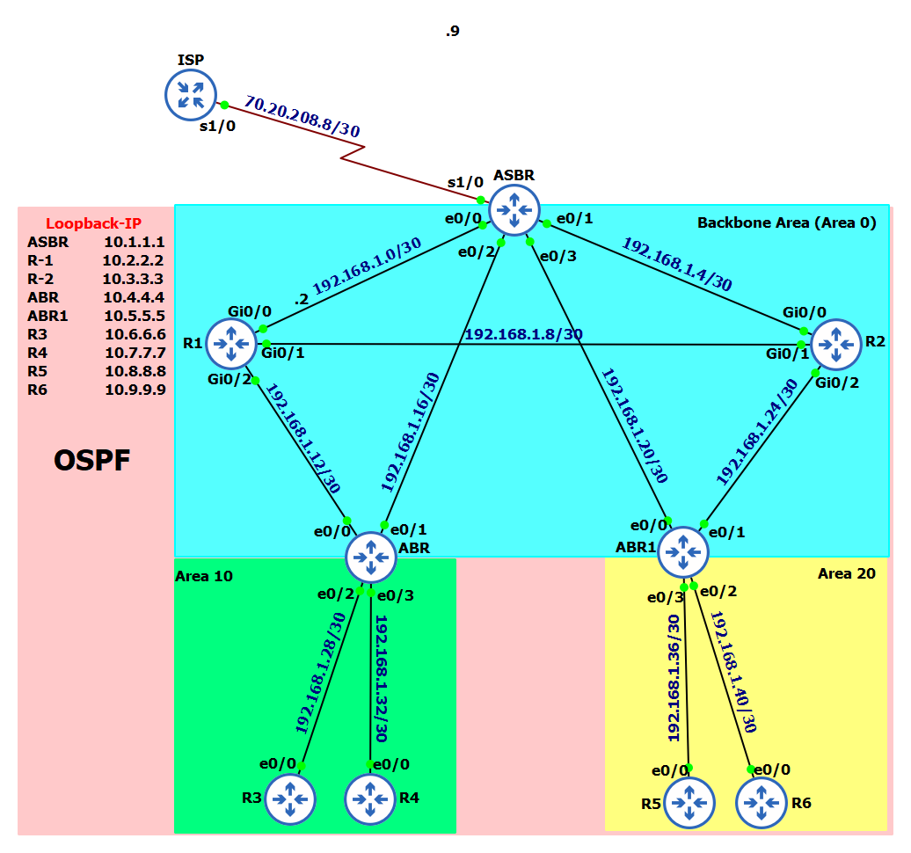

# OSPF Project using GNS3

This project demonstrates the implementation of a multi-area OSPF network using GNS3. The objective is to gain hands-on experience with OSPF, analyze traffic, and troubleshoot configurations.

## Objectives
- Learn OSPF configuration and operations.
- Design a multi-area OSPF topology.
- Analyze OSPF traffic using tools like Wireshark.
- Troubleshoot OSPF configurations.

## Topology Overview

## Repository Structure
- `Topology/`: Contains the network diagram and topology files.
- `Configurations/`: Router configuration files for all devices.
- `Traffic_Analysis/`: Wireshark packet captures and traffic analysis documentation.
- `Troubleshooting/`: Issues encountered and their resolutions.
- `OSPF.gns3`: For deploying the lab in GNS3
- `Lessons_Learned.md`: Key takeaways from the project.

## Tools Used
- **GNS3:** Network simulation platform.
- **Wireshark:** For analyzing OSPF packets.
